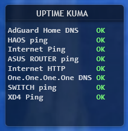

# Rainmeter Uptime Kuma Widget

A clean and lightweight Rainmeter widget that displays the status of your self-hosted Uptime Kuma monitors directly on your desktop.

## ✨ Features

- ✔ Displays all monitors from Uptime Kuma
- ✔ Color-coded status:
  - OK (green)
  - DOWN (red)
  - WAIT (yellow)
- ✔ Fully integrated with the Illustro skin style
- ✔ No popups or visible console windows
- ✔ Lightweight and efficient (file-based, no constant API polling)
- ✔ Works offline within local network

---

## ⚙️ How It Works

1. A PowerShell script (`kuma.ps1`) fetches data from Uptime Kuma API
2. The script writes formatted output to `kuma.txt`
3. Rainmeter reads the file via a Lua script (`KumaReader.lua`)
4. The widget displays the data with proper formatting and colors

To avoid console popups, the script is executed via Windows Task Scheduler in the background.

---

## 📦 Installation

### 1. Requirements

- Rainmeter installed
- Uptime Kuma running locally or remotely
- Windows Task Scheduler

---

### 2. Copy Files

Place the following files into:
Documents\Rainmeter\Skins\illustro\Kuma\

- `Kuma.ini`
- `KumaReader.lua`
- `kuma.ps1`

---

### 3. Configure Uptime Kuma

Edit `kuma.ps1` and update:
$BaseUrl = "http://YOUR_KUMA_IP:3001"
$Slug    = "YOUR_STATUS_PAGE"

4. Setup Task Scheduler

Create a new task:

Trigger:
At log on
Repeat every 1 minute

Action:

powershell.exe

Arguments:

-WindowStyle Hidden -ExecutionPolicy Bypass -NoProfile -File "C:\Users\YOUR_USER\Documents\Rainmeter\Skins\illustro\Kuma\kuma.ps1"
Enable:
Run with highest privileges
Hidden
5. Load the Skin
Open Rainmeter

Go to:

illustro → Kuma → Kuma.ini
Click Load
🎨 Customization
Change colors (in Kuma.ini)
InlineSetting=Color | 120,255,120,255
InlinePattern=OK

InlineSetting2=Color | 255,120,120,255
InlinePattern2=DOWN

InlineSetting3=Color | 255,220,120,255
InlinePattern3=WAIT
Adjust refresh rate

Edit Task Scheduler interval (recommended: 30–60 seconds)

🧠 Notes
This widget uses file-based communication for stability
Avoids direct API calls from Rainmeter (which can be unreliable)
Designed for minimal system impact

🤝 Contributing
Feel free to fork, improve, or adapt this widget for your setup.
